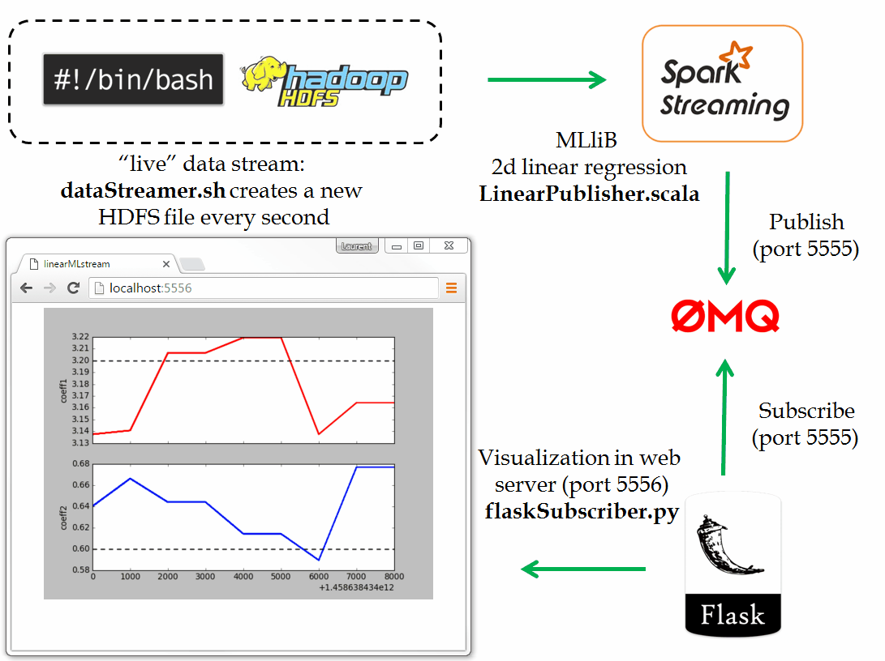

"**Real-time predictive analytics**" has emerged as a topic of growing interest in the data science community.  One factor contributing to the appeal of statistical learning methods based on live streaming data is the ability to generate models that are able to react and adapt themselves to **non-stationary data distribution** in real time (as opposed to batch processing that need to retrain models periodically).

While numerous implementations of online machine learning algorithms are publicly available, it it is not always easy to find candid demonstrations of how to incorporate them into a lightweight **real time visualization platform**.  Among its many applications one can see how such a tool would allow not only a deeper insight into the dynamics of the models as well as the possibility of being quickly alerted when models start to misbehave.

The purpose of this project is to provide a simple demonstration of how one may "hack" together such a flow of data.
Obviously, one should regard this as basic **toy tutorial** "do it yourself" in order to get started rather than a complete real world implementation.

* For the sake of simplicity, we prepare a **synthetic data set** consisting of random points `(y, x1, x2)` which approximately satisfy the following linear relationship `y = c1 x1 + c2 x2 + noise` where the coefficients `(c1, c2)` and the intensity of the noise serve as control parameters.

- Adopting supervised learning terminology, one may refer to `y` as a **label** and to each instance of `(x1, x2)` as a **feature vector**.  Naturally, the objective then becomes to uncover the values of the coefficients `(c1, c2)` given the feature vectors 
and their labels. 

- In order to **mimic streaming data**, one can generate batches of feature vectors and labels (60 at a time in our case) and save them as new HDFS files every second or so in a directory that the spark streaming application uses a input source.
> _(You can do this by running the bash script dataStreamer.sh directly from the command line.)_

- Every time a new batch of data is produced, the spark application applies a least squares minimizer (**StreamingLinearRegressionWithSGD** in our case) which **updates the regression coefficients `(c1, c2)`**.
> _(You can do this by running linearPublisher.scala directly from your IDE for simplicity)_

Of course, in a real world scenario, generating real time labels would probably have its own intrinsic ambiguities 
depending on the particular business you happen to be operating in.  Furthermore, the underlying data would not be from a simple bash script but would come from more sophisticated destinations such as an IoT devices, financial / weather / social network updates....

- The final step consists in providing a **real time visualization** of the model and of its history.  This can be accomplished through the **publish-subscribe** messaging pattern by using ZeroMQ.  In our case, the spark streaming application acts as the publisher in order to communicates via a TCP socket with a **HTTP web server** which acts as the subscriber and prepares a visual rendering of the dynamics of the model (`localhost:5556`).
> _(For this, you'll need to have started the flask server by running flaskSubscriber.py)_

+ The illustration provides a cartoon summary of the flow of data described above:

**Disclaimer**:

As claimed in the beginning, this project is intended to be a demonstration / tutorial showing that a complex visualization system requiring the wiring together of many disparate technologies can be accomplished quite simply in a few lines of code.  As such, no special care has been given to _"portability"_ or _"professionalism"_.  Rather, the whole enterprise should be considered as a "hack" that may (hopefully) be a source of inspiration for others.
